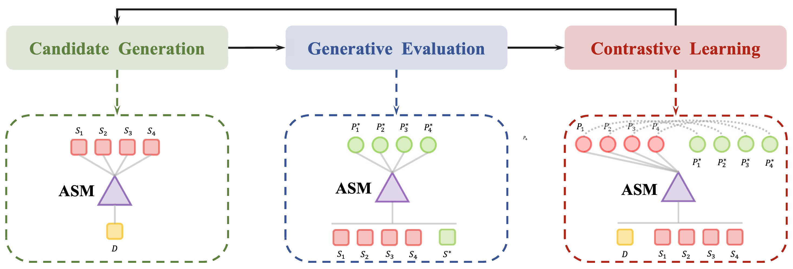

# GECSum
[](https://github.com/xjw-nlp/SimCAS/blob/main/LICENSE)
[](https://github.com/xjw-nlp/SimCAS/blob/main/DATA_LICENSE)
[](https://www.python.org/downloads/release/python-380/)

The repository contains the code, data, and models for the paper [GECSum: Generative Evaluation-Driven Sequence Level Contrastive Learning for Abstractive Summarization]().
## Quick Links
- [Recap](#recap)
- [Installation](#installation)
- [Training](#training)
- [Evaluation](#evaluation)
## Recap
In this paper, we propose a generative evaluation-driven sequence-level contrastive learning framework for abstractive summarization.

## Installation
- `conda create --name env --file spec-file.txt`
- `pip install -r requirements.txt`
- Using `compare_mt` -> https://github.com/neulab/compare-mt
  ```console
  git clone https://github.com/neulab/compare-mt.git
  cd ./compare-mt
  pip install -r requirements.txt
  python setup.py install
  ```
- For the ROUGE calculation with the standard Perl package from [here](https://github.com/summanlp/evaluation/tree/master/ROUGE-RELEASE-1.5.5).
  ```console
  # make sure perl and cpan is installed
  perl --version
  cpan --version

  # install XML::DOM
  # may need sudo
  sudo cpan XML::DOM
  
  # download ROUGE-1.5.5
  git clone https://github.com/summanlp/evaluation
  
  # ROUGE 1.5.5 can be found in evaluation/ROUGE-RELEASE-1.5.5
  export ROUGE=/absolute/path/to/ROUGE-RELEASE-1.5.5
  
  # Optional: setting environment variable
  echo "export ROUGE=\"${ROUGE}\"" >> ~/.bashrc
  source ~/.bashrc
  
  # modify the db file
  cd ${ROUGE}/data/WordNet-2.0-Exceptions/
  mv WordNet-2.0.exc.db WordNet-2.0.exc.db.bak
  ./buildExeptionDB.pl . exc WordNet-2.0.exc.db
  
  cd $ROUGE
  ./runROUGE-test.pl
  # if there is no error message, then you have successfully installed ROUGE
  ```
- For BERTScore, using evaluation tool from [here](https://github.com/Tiiiger/bert_score)

## Preprocessing
We use the following datasets for our experiments. 
- CNNDM -> [https://cs.nyu.edu/~kcho/DMQA/](https://cs.nyu.edu/~kcho/DMQA/)
- XSum -> [https://github.com/armancohan/long-summarization](https://github.com/armancohan/long-summarization)
- SAMSum -> [https://github.com/luyang-huang96/LongDocSum](https://github.com/luyang-huang96/LongDocSum)
- MeQSum -> [https://github.com/mingdachen/SummScreen](https://github.com/mingdachen/SummScreen)

We can also download the preprocessed datasets: [CNNDM](https://huggingface.co/datasets/ccdv/arxiv-summarization), [XSum](https://huggingface.co/datasets/ccdv/pubmed-summarization), [SAMSum](https://huggingface.co/datasets/ccdv/govreport-summarization), [MeQSum]().
  
## Training
```console
python main.py --cuda --gpuid [list of gpuid] --config [name of config] -l -p [number of port]
```
## Evaluation
### Example on CNNDM
```console
python main.py --cuda --gpuid 0 --config cnndm -e --model_pt cnndm/model_generation.bin
```
## Citation
```console

```